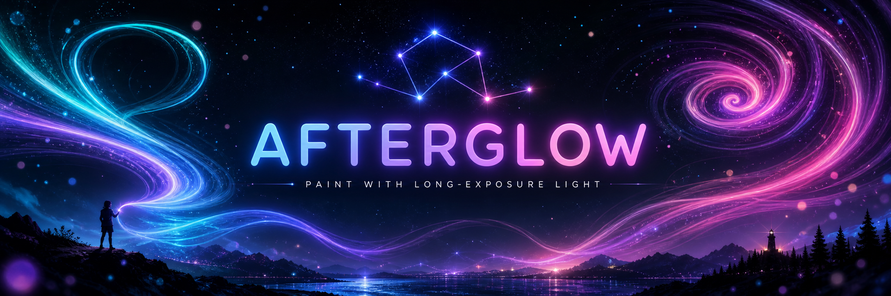

<p align="center">
  
</p>

<h1 align="center">AFTERGLOW</h1>

<p align="center">
  <strong>You don't move a character — you leave light on.</strong><br>
  A novel, endless HTML5 light-painting game. Hold the shutter open and steer glowing
  lights to burn shimmering trails onto a night sky.
</p>

<p align="center">
  <a href="https://DLinacre.github.io/afterglow/"><b>▶ Play it live</b></a>
</p>

<p align="center">
  <a href="https://DLinacre.github.io/afterglow/"></a>
  <a href="../../actions/workflows/deploy.yml"></a>
  
  
  
</p>

---

## ✨ What is this?

Most "photography games" are about *pointing a camera and framing a shot*. **AFTERGLOW is
different: the light you leave on is the gameplay.** Hold your finger down to open the
shutter, and every glowing pen you steer paints a permanent, luminous trail onto a
long-exposure night photo. It's a calm, beautiful score-chase that's easy to learn and
deep to master — and it teaches you to draw better as you play.

> The core verb — *painting with persistent long-exposure light* — is what makes AFTERGLOW
> genuinely new. It was designed from scratch, checking existing games at every step to
> keep the idea original.

## 🎮 How to play

- **Hold & drag** anywhere to open the shutter and paint with light.
- Fill the faint, pulsing **guide shape**. A golden **Trace Coach** shows you the stroke
  order and direction so you learn good technique.
- Tap **Develop Photo** to score your exposure (coverage vs. spill), earn ⭐, and read
  personalised feedback that helps you improve.
- Photos are **endless** — after the hand-crafted intros, every shape is procedurally
  generated (rose curves, Lissajous figures, spirographs, star-polygons, constellations…).

## 🖌️ Features

| | |
|---|---|
| ♾️ **Endless play** | Deterministic procedural shapes — photo #N is always the same, so it's fair *and* infinite. |
| 📅 **Daily Challenge** | One shape seeded by the date — the same for everyone, all day. |
| 🔊 **Generative audio** | A synthesised ambient pad plus chimes that follow your painting speed & height. No audio files — it's all live. |
| 🔥 **Streaks** | Chain photos that score 65%+ for a running streak counter. |
| ↶ **Undo / Redo** | Full stroke history (up to 20 steps) — never fear a wrong move. Works with `Z` / `X` keys too. |
| 🖌️ **10 brushes** | Comet, Ribbon, Sparkler, Neon Pen, **Ink** (speed = pressure), **Chroma** (rainbow split), plus **Mirror**, **Trine**, **Kaleidoscope** & **Bloom** for instant symmetry art. |
| 📏 **Brush size** | A size slider (55–180%) — plus `↑`/`↓` keys — for fine detail or bold sweeps. |
| 🎨 **12 palettes** | Aurora · Ember · Ice · Neon · Gold · Rose · Sunset · Lagoon · Candy · Toxic · Mono · Prism. |
| 🖼️ **17 shape families** | Roses, Lissajous, spirographs, star-polygons, butterflies, superformula blooms, constellations, waves & more. |
| 🎓 **Learn to draw** | Animated stroke-order coach + 12 rotating technique tips + targeted post-photo feedback. |
| ⭐ **Progress tracking** | Best score and a lifetime-stars total, saved locally. |
| 🌌 **Free Studio** | A no-pressure mode to just make art. |
| 💾 **Save & Share** | Export a PNG, or share straight to other apps via the Web Share API. |
| ⌨️ **Keyboard shortcuts** | `Z` undo · `X` redo · `Space` develop · `↑`/`↓` brush size · `C` clear (Studio). |
| 📱 **Mobile-first** | One-thumb controls, safe-area aware, works offline. |
| 🪶 **Zero dependencies** | One HTML file. No build, no server, no tracking. |

## 🚀 Run it

**Just open `index.html`** in any modern browser. That's the whole install.

Or serve locally (recommended so `Save Photo` and touch events behave exactly as in
production):

```bash
# any static server works — pick one
python3 -m http.server 8000
# then visit http://localhost:8000
```

## 🛠️ Built with

- **Vanilla JavaScript** + the HTML5 **Canvas 2D** API — three layered canvases
  (background, additive light paint, live FX/coach).
- Additive `globalCompositeOperation = 'lighter'` blending for authentic glow.
- A pre-rendered radial-gradient **sprite atlas** for fast, smooth trails.
- Seeded PRNG (`mulberry32`) for deterministic, endless level generation.
- **No frameworks, no build tooling, no dependencies.**

## 🧩 Extending it

AFTERGLOW is built on simple **registries** — add a brush, palette, shape, or tip by
dropping in a single entry, and it wires itself into the UI automatically. See
**[DEVGUIDE.md](DEVGUIDE.md)** for the full map, tuning knobs, and worked examples.

```js
// add a palette — appears in the ⚙ menu automatically
{ name: 'Sunset', lo: 350, hi: 40, speed: 1.0, cycle: false },
```

## 🌐 Deployment

Every push to `main` auto-deploys to **GitHub Pages** via
[`.github/workflows/deploy.yml`](.github/workflows/deploy.yml).
Live at **https://DLinacre.github.io/afterglow/**.

## 🗺️ Roadmap

- [x] Undo / redo with stroke history
- [x] Expanded brush set (10) + brush-size control
- [x] Lifetime progress tracking (stars) + streaks
- [x] Keyboard shortcuts
- [x] Ambient audio that responds to painting speed
- [x] Daily challenge (seed the RNG with the date)
- [x] Native share sheet via the Web Share API
- [ ] "No-go" dark-zone tension mode (scoring mask already exists)
- [ ] Unlockable brushes & palettes tied to star totals
- [ ] Online leaderboard for the daily challenge

## 📄 License

[MIT](LICENSE) © David Linacre

<p align="center"><sub>Made with light. ✦</sub></p>
